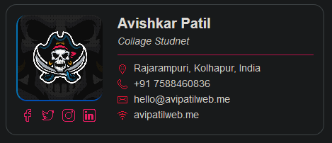

<h2 align="center"> It Just A Simple Email Signature</h2>

<a href="https://proavipatil.github.io/Email-Signature-1/">ProAviPatil.GitHub.io/Email-Signature-1</a>

<h4 align="center">Open The Above Link In Browser and Follow</h4>
<h5 align="center"> • Click CTRL + A  
                    • Then CTRL + C  
                    • Then Go In Gmail   
                    • CTRL + V as it as  
</h5> 

